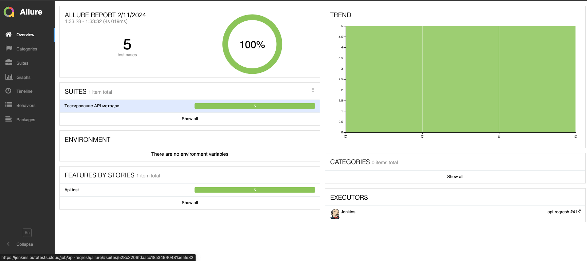

# Проект по автоматизации тестирования API для сайта [REQRES.IN](https://reqres.in/)

<p align="center">  


> Reqres моделирует реальные сценарии применения.

<a name="наверх"></a>

## :scroll: Содержание:
* <a href="#tools">Используемый стек</a>
* <a href="#cases">Примеры автоматизированных тест-кейсов</a>
* <a href="#console">Запуск из терминала</a>
* <a href="#jenkins">Сборка в Jenkins</a>
* <a href="#allure">Allure отчет</a>
* <a href="#allure-testops">Интеграция с Allure TestOps</a>
* <a href="#jira">Интеграция с Jira</a>
* <a href="#telegram">Уведомление в Telegram при помощи бота</a>


____
<a id="tools"></a>
## :computer:<a name="Используемый стек">**Используемый стек:**</a>

<p align="center">
<a href="https://www.java.com/"></a>
<a href="https://aerokube.com/selenoid/"></a>
<a href="https://github.com/allure-framework/allure2"></a>
<a href="https://qameta.io/"></a>
<a href="https://gradle.org/"></a>
<a href="https://junit.org/junit5/"></a>
<a href="https://github.com/"></a>
<a href="https://www.jenkins.io/"></a>
<a href="https://web.telegram.org/a/"></a>
<a href="https://www.atlassian.com/ru/software/jira/"></a>
</p>

____
<a id="cases"></a>
## <a name="Примеры автоматизированных тест-кейсов">**Примеры автоматизированных тест-кейсов:**</a>
____
- ✓ *Проверка списка пользователей*
- ✓ *Проверка "Пользователь не найден"*
- ✓ *Создание пользователя*
- ✓ *Удаление пользователя*
- ✓ *Успешная регистрация пользователя*


<a id="console"></a>
## :keyboard: Запуск автотестов

***Локальный запуск тестов:***
```
gradle clean test 
```
***Удаленный запуск тестов:***
```
clean test 
```
____
<a id="jenkins"></a>
## </a><a name="Сборка"></a>Сборка в [Jenkins](https://jenkins.autotests.cloud/job/api-reqresh/)</a>
<p align="center">  
<a href="https://jenkins.autotests.cloud/job/api-reqresh/"></a>  
</p>

<a id="allure"></a>
## </a> Allure <a target="_blank" href="https://jenkins.autotests.cloud/job/api-reqresh/allure/">отчёт</a>

### *Основная страница отчёта*

<p align="center">  
  
</p>  

<a id="allure-testops"></a>
## </a>Интеграция с <a target="_blank" href="https://allure.autotests.cloud/project/4026/launches">Allure TestOps</a>

<p align="center">  
  
</p>  


<a id="jira"></a>
## </a>Интеграция с <a target="_blank" href="https://jira.autotests.cloud/browse/HOMEWORK-1100">Jira</a>

<p align="center">  
  
</p>

<a id="telegram"></a>
## </a>Уведомление в Telegram 

<p align="center">  
  
</p>  